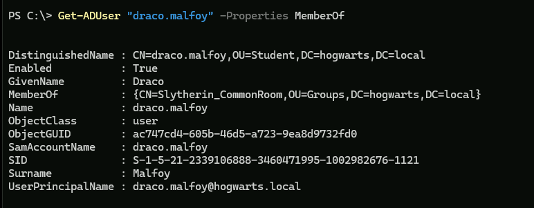
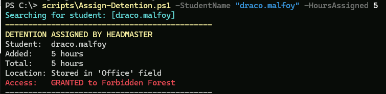
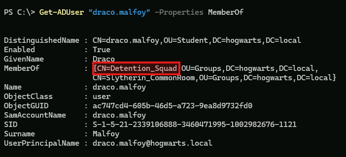

# Automated Identity Lifecycle System (The "Hogwarts" Lab)
### Identity & Access Management (IAM) | PowerShell | Azure

  

## Table of Contents
- [Project Overview](#project-overview)
- [Architecture & Logic](#architecture--logic)
- [The Scripts (Automated Workflows)](#-the-scripts-automated-workflows)
- [Implementation & Verification](#implementation--verification)
- [Skills Demonstrated](#%EF%B8%8F-skills-demonstrated)

## Project Overview

This project uses the Hogwarts ecosystem as a conceptual framework to demonstrate advanced enterprise **Identity & Access Management (IAM)** protocols. By mapping "Houses" to Departments and "Dorms" to secure resources, we model a hybrid security environment that combines standard Role-Based Access Control (RBAC) with dynamic Attribute-Based Access Control (ABAC).

The core engineering challenge focuses on **Dynamic Security Postures**. In this lab, the "Forbidden Forest" represents a restricted, high-risk resource. Access to this zone is not static; it is governed by a strict **Just-In-Time (JIT)** protocol. This simulates a real-world "Break Glass" or "Penalty" scenario: a user's identity attribute (detention hours) changes, triggering an automated workflow that temporarily grants them privileged access to a restricted security group. Once the attribute is cleared, a remediation engine automatically revokes the access, returning the user to their baseline posture.

### Key Goals

* **Automated Provisioning (RBAC):** Replaced manual Active Directory entry with a bulk ingestion script (`Import-Hogwarts.ps1`) that parses structured HR data (CSV) to create users, OUs, and Security Groups.
* **Attribute-Based Access Control (ABAC):** Implemented a "Policy Enforcement Point" script (`Assign-Detention.ps1`) that grants permissions based on user attributes (`physicalDeliveryOfficeName`) rather than static group assignments.
* **Self-Healing Lifecycle:** Developed a remediation script (`Log-Service.ps1`) that acts as a "Garbage Collector" for permissions—monitoring user status and automatically revoking access the moment it is no longer required.

## Architecture & Logic

| Component | Technology | Description |
| :--- | :--- | :--- |
| **Identity Provider** | Windows Server 2022 | The authoritative source for identity (AD DS) and name resolution (DNS). |
| **Cloud Infrastructure** | Microsoft Azure | Hosted in a custom Resource Group with strict Network Security Groups (NSG) to simulate an air-gapped lab. |
| **The "Sorting Hat"** | `Onboarding-Provisioning.ps1` | **(RBAC)** An onboarding engine that reads CSV data and maps users to organizational units and primary security groups based on "House" traits. |
| **The "Headmaster"** | `Assign-Detention.ps1` | **(ABAC)** A policy enforcement script that modifies identity attributes (adding "Hours") and triggers JIT group membership. |
| **The "Groundskeeper"** | `Log-Service.ps1` | **(Remediation)** A maintenance script that decrements attribute values and removes users from restricted groups upon task completion. |

---

## ⚡ The Scripts (Automated Workflows)

### 1. The Onboarding Engine (`Onboarding-Provisioning.ps1`)
This script serves as the primary Identity Lifecycle Engine. It transforms raw user data (CSV) into functional Active Directory objects, implementing logic-based authorization rather than simple creation.
* **Dynamic RBAC:** Automatically places users into Security Groups (e.g., *Gryffindor_CommonRoom*) based on their "House" attribute. This ensures baseline access is granted immediately upon onboarding.
* **Conditional Access (The "Hermione Rule"):** Implements Attribute-Based Access Control (ABAC). The script evaluates multiple attributes (Role + House + Gender) to determine granular file permission scope. For example, female students receive dual-access tokens (Boys & Girls Dorms), while male students are restricted to single-access.
* **Privileged Access Management (The "Hagrid Rule"):** Handles Exception Management. It dynamically provisions elevated privileges (e.g., *ForbiddenForest_Keys*) for users with specific flags in their identity record, automating what is usually a manual ticket request process.

### 2. The "Detention" Enforcement Engine (`Assign-Detention.ps1`)
This script demonstrates **Dynamic Access Control** by modifying user attributes to trigger security changes. It repurposes a standard Active Directory attribute (*OfficePhone*) to store a custom integer value representing "Detention Hours."
* **Attribute Modification:** Instead of manually adding a user to a group, the script modifies the identity object itself to reflect a new status.
* **Policy Enforcement:** By adding the user to the *Detention_Squad* group, the script dynamically changes the user's effective permissions. In this lab, this **grants** access to the Forbidden Forest (to serve detention), simulating a workflow where a user is temporarily elevated to access a restricted zone for a specific job.

### 3. The "Detention Completion" Check (`Log-Service.ps1`)
This script handles the "Return to Standard" phase of the lifecycle, proving that security controls can be dynamic and self-correcting.
* **Automated Deprovisioning:** The script monitors the "Hours" attribute. When the risk is remediated (balance reaches zero), the system automatically revokes the *Detention_Squad* membership.
* **Self-Healing State:** The system automatically corrects the user's access level back to baseline without human intervention, reducing "Ticket Fatigue" for IT staff.

---

## Implementation & Verification

The following workflow demonstrates the execution of the Just-In-Time (JIT) access policies using Draco Malfoy as the test subject.

### 1. Baseline Access Verification
We verify the user's starting state. The screenshot confirms Draco is a member of his House (`Slytherin_CommonRoom`) but is **not** a member of the restricted `Detention_Squad`.

### 2. Policy Enforcement (The "Detention" Trigger)
We execute the `Assign-Detention.ps1` script. The output highlights the **Attribute-Based Access Control (ABAC)** logic in action: the script updates the "Office" attribute and immediately flags the user for "GRANTED" access to the Forbidden Forest.

### 3. JIT Access Grant (Group Membership)
A check of the user object confirms the immediate security posture change. Draco has been dynamically added to `CN=Detention_Squad`, which inherits the necessary Read/Write ACLs for the restricted folder.

### 4. Remediation Cycle (The "Log-Service")
We execute `Log-Service.ps1` to simulate the user performing their required tasks. The screenshot demonstrates the **Self-Healing logic**:
* **First Run:** The system detects 10 total hours, logs 5, and calculates a remaining balance (Status: `[PARTIAL]`).
* **Second Run:** Once the balance hits zero, the script clears the record.

### 5. Automated Revocation
A final audit of the user object confirms the loop is closed. The system has automatically removed Draco from the `Detention_Squad`, returning him strictly to his baseline permissions without manual admin intervention.

---

## 🛡️ Skills Demonstrated
* **PowerShell Scripting:** Loops, Variables, CSV Parsing, AD Modules.
* **Identity Management:** OU Design, GPO Application, RBAC.
* **Security Engineering:** Automating defensive responses to user behavior.
